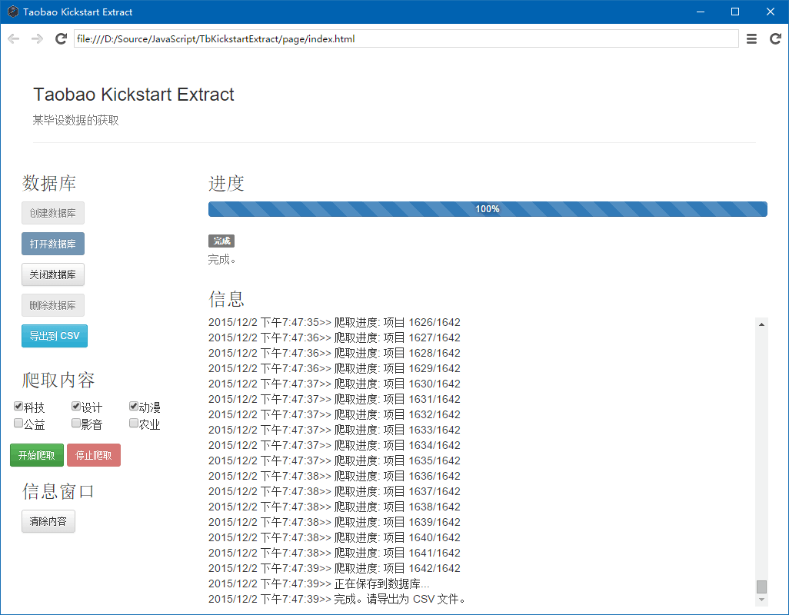

# 淘宝众筹数据抓取

村长（不是我）的毕设题目用到这个数据，手工抓又麻烦，怎么办呢……

就要有不怕麻烦的<del>人类</del>机器来做这事——“技术进步的动力”。



## 配置

需要 NodeJS、NPM 和 NW.js。

其他的已经基本上配置完毕，只需要执行：

```
npm install
bower install
gulp build
```

（自动化构建就是好！）

## 运行

使用 NW.js 运行，指定其参数为本目录即可。

```
nw.exe {本目录的路径}
```

导出了 CSV 文件（`tbkse-result.csv`）之后，NodeJS 所用的字符串编码是 UTF-8，而 Excel 认的是 GBK（视用户环境而定），所以需要进行编码转换。我并没有使用 `node-iconv`，因为考虑到村长计算机上没有 C++ 编译器。所以一个半手工的方案就是：配置一个 GNU 环境（含 `iconv`），然后运行 `iconv-utf8-gbk.bat` 即可。

如果有 SQLite 的操作库或软件，也可以直接去读写 `tbkse.db` 的内容。

## 能抓什么？

试试看就知道。

处理上，只做了村长需要的那部分。不过我已经给各位准备了用到的数据中比较完整的契约定义，怎么使用就请发挥想象力吧。

## 文档和其他

过程的事后简要记录见[记录文档](docs/taobao-izhongchou-rec.txt)。

感谢淘宝的程序员，留下了不少痕迹（和潜在的hack，从测试中发现的），有了它们分析起来简单多了。

数据契约定义在 `page/contracts` 目录下。

数据表的列设置见 `scripts/sql/create-table.sql` 和 `scripts/csv-schema.txt`。

整体的风格是用 TypeScript 强行模拟了一下传统 WinForms 的开发方式。试用了一下 Web Worker，这个通信方便多了。

本来想使用 `sqlite`，结果编译总是失败，似乎是环境变量没有传给 `link`（传给 `cl` 已经是我的极限了……）。换上的 [SQL.js](https://github.com/kripken/sql.js) 是一个相当不错的库，更何况它还只是作者的 Emscripten 的副产物……
